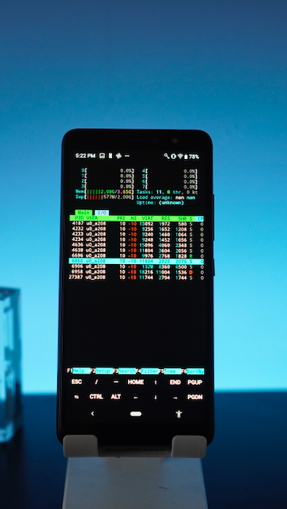
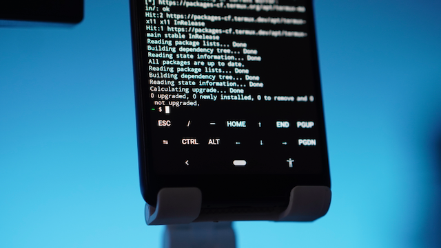

# Homelab Project with Termux

This project is aimed at running a homelab on an old Android phone using Termux. It includes several components such as Airflow, some automation tools written in Rust, and a dashboard for monitoring things.

<table>
    <tr>
        <td>
            
        </td>
        <td>
            
        </td>
    </tr>
</table>

# Installation

To install the project, please refer to the scripts folder. It contains all the necessary scripts and instructions for setting up the components.

# Components

## Airflow

Airflow is a platform to programmatically author, schedule, and monitor workflows. It provides an easy-to-use UI and a rich set of operators for creating complex workflows.

## Automation Tools

The project includes some automation tools written in Rust. These tools can be used to automate various tasks, such as file management, data processing, and more.

## Dashboard

The dashboard is a web-based interface for monitoring the various components of the homelab. It provides real-time information about the status of each component and allows for easy management of the homelab.

# License

MIT.
