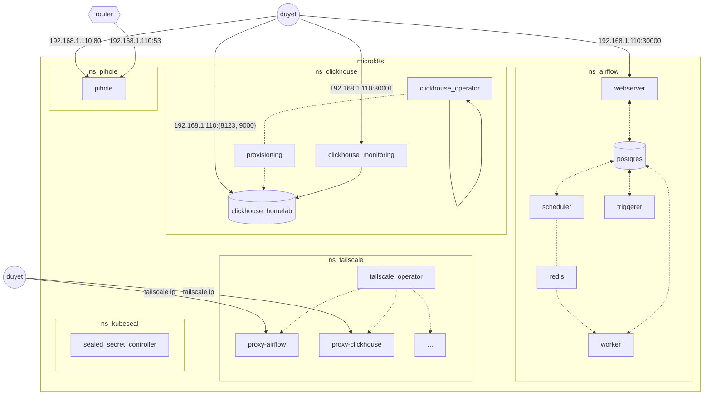
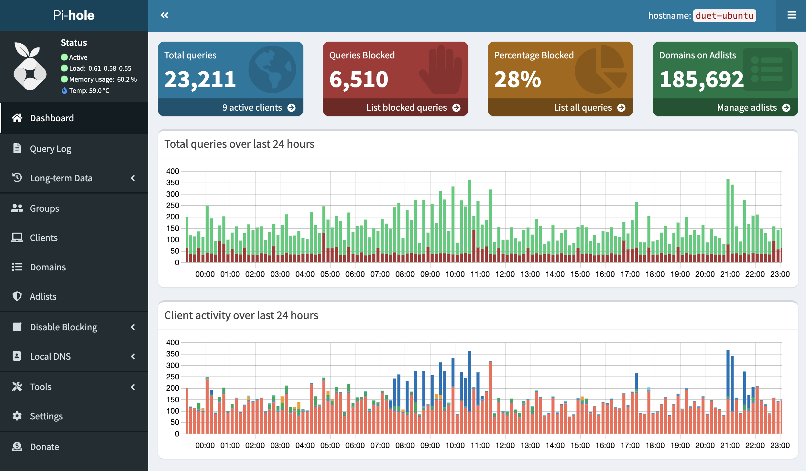

# Homelab Project

This personal project is aimed at running a homelab on my Raspberry Pi, MiniPC and old Android phone. 
It includes several components such as Airflow, some automation tools written in Rust, and a dashboard for monitoring things.

Most of the configuration files and data schema are open and can be found in the this repo.

<table>
  <tr>
    <td></td>
    <td></td>
  </tr>
</table>



# How to use

1. Install microk8s to your server: https://microk8s.io/docs/install-alternatives

2. Run setup `./apply.sh` script to install the services on each namespace.

    ```bash
    $ cd ./tailscale
    $ ./apply.sh

    Context "microk8s" modified.
    Current namespace: tailscale
    namespace/tailscale created
    customresourcedefinition.apiextensions.k8s.io/connectors.tailscale.com created
    customresourcedefinition.apiextensions.k8s.io/proxyclasses.tailscale.com created
    serviceaccount/operator created
    serviceaccount/proxies created
    role.rbac.authorization.k8s.io/operator created
    role.rbac.authorization.k8s.io/proxies created
    clusterrole.rbac.authorization.k8s.io/tailscale-operator created
    rolebinding.rbac.authorization.k8s.io/operator created
    rolebinding.rbac.authorization.k8s.io/proxies created
    clusterrolebinding.rbac.authorization.k8s.io/tailscale-operator created
    secret/operator-oauth created
    deployment.apps/operator created
    ingressclass.networking.k8s.io/tailscale created
    ```

Note that to delete services included the namespace, apply with `--delete` flag.

```bash
$ cd ./tailscale
$ ./apply.sh --delete
```

# Notes

<details>
    <summary>
        <strong>Kubeseal</strong>: one-way encrypted secrets.
    </summary>

Kubeseal is using for encrypting the secrets. See more details at https://github.com/bitnami-labs/sealed-secrets

Must install the Sealed Secret Controller first:

```bash
cd ./kubeseal
./apply.sh
```

Add/update a secret:

```bash
./_helpers.sh kubeseal_secret_create <secret_name> <key> <value> <file>

# Example add/update clickhouse password for user "duyet"
./_helpers.sh kubeseal_secret_create clickhouse-password duyet ahihi123 ./clickhouse/20-clickhouse-installations/40-clickhouse-password-secret.yaml
```

</details>


<details>
    <summary>
        <strong>Tailscale</strong>: a private network for homelab.
    </summary>

Tailscale is using for expose the services to your personal network. See more details at https://tailscale.com/use-cases/homelab/.


Make sure to create the secret contains the Tailscale OAuth token before applying.

```yaml
# File: tailscale/10-tailscale-operator/tailscale-secret.yaml
apiVersion: v1
kind: Secret
type: Opaque
metadata:
  name: operator-oauth
  namespace: tailscale
data:
  client_id: <base64 encoded client_id>
  client_secret: <base64 encoded client_secret>
```

```bash
cd ./tailscale
./apply.sh
```

</details>


<details>
    <summary>
        <strong>Pihole</strong>: Network-level ads blocking and home network statistics.
    </summary>



I don't use DHCP service from PiHole, so you might need to assign the IP to host name manually for your devices to display in the UI.

Update the `hostAliases` in [pihole/40-statefulset.yaml](./pihole/40-statefulset.yaml):

```bash
  hostAliases:
    - ip: 192.168.1.69
      hostnames: [duet-mac]
    - ip: 192.168.1.70
      hostnames: [duet-iphone]
```

The password to access the web UI is `123123` as the `WEBPASSWORD` variable.

</details>

<details>
    <summary>
        <strong>Airflow</strong>: schedule and monitor workflows.
    </summary>

Most of the PV using hostPath storageClass pointing to `/media/duyet/Data/k8s-data` so you might need to change it to your own path.

See: [./airflow/10-postgres/10-postgres-airflow-sc.yaml](./airflow/10-postgres/10-postgres-airflow-sc.yaml)

Access the Airflow Webserver using NodeIP: http://localhost:30000

</details>

<details>
    <summary>
        <strong>ClickHouse</strong>: is the fastest and most resource efficient open-source database for real-time apps and analytics.
    </summary>


- Define ClickHouse cluster definition via `ClickHouseInstallation` resource. Example [./clickhouse/20-clickhouse-installations/20-clickhouse-cluster-homelab.yaml](./clickhouse/20-clickhouse-installations/20-clickhouse-cluster-homelab.yaml)
- ClickHouse Monitoring (http://192.168.1.110:30001) is the UI for managing and monitoring a ClickHouse instance, currently supporting only one per cluster. If you have more than one, please deploy another instance of the web UI. Github: https://github.com/duyet/clickhouse-monitoring


</details>

# License

MIT.
