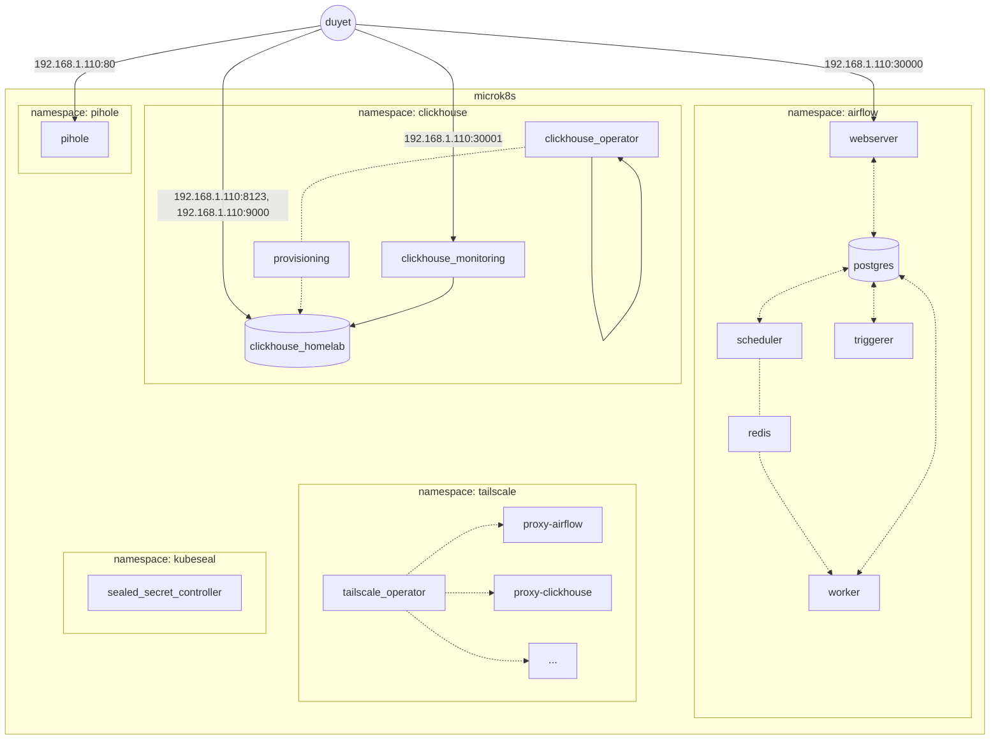

# Homelab Project

This personal project is aimed at running a homelab on my Raspberry Pi, MiniPC and old Android phone. 
It includes several components such as Airflow, some automation tools written in Rust, and a dashboard for monitoring things.

Most of the configuration files and data schema are open and can be found in the this repo.

<table>
  <tr>
    <td></td>
    <td></td>
  </tr>
</table>



# How to run

Apply the setup script to install the services on each Kubernetes namespace.

```bash
$ cd ./tailscale
$ ./apply.sh

Context "microk8s" modified.
Current namespace: tailscale
namespace/tailscale created
customresourcedefinition.apiextensions.k8s.io/connectors.tailscale.com created
customresourcedefinition.apiextensions.k8s.io/proxyclasses.tailscale.com created
serviceaccount/operator created
serviceaccount/proxies created
role.rbac.authorization.k8s.io/operator created
role.rbac.authorization.k8s.io/proxies created
clusterrole.rbac.authorization.k8s.io/tailscale-operator created
rolebinding.rbac.authorization.k8s.io/operator created
rolebinding.rbac.authorization.k8s.io/proxies created
clusterrolebinding.rbac.authorization.k8s.io/tailscale-operator created
secret/operator-oauth created
deployment.apps/operator created
ingressclass.networking.k8s.io/tailscale created
```

To delete services included the namespace, apply with `--delete` flag.

```bash
$ cd ./tailscale
$ ./apply.sh --delete
```

# Notes

### Kubeseal

Kubeseal is using for encrypting the secrets. See more details at https://github.com/bitnami-labs/sealed-secrets

Must install the Sealed Secret Controller first:

```bash
cd ./kubeseal
./apply.sh
```

Add/update a secret:

```bash
./_helpers.sh kubeseal_secret_create <secret_name> <key> <value> <file>

# Example add/update clickhouse password for user "duyet"
./_helpers.sh kubeseal_secret_create clickhouse-password duyet ahihi123 ./clickhouse/20-clickhouse-installations/40-clickhouse-password-secret.yaml
```


### Tailscale

Tailscale is using for expose the services to your personal network. See more details at https://tailscale.com/use-cases/homelab/.


Make sure to create the secret contains the Tailscale OAuth token before applying.

```yaml
# File: tailscale/10-tailscale-operator/tailscale-secret.yaml
apiVersion: v1
kind: Secret
type: Opaque
metadata:
  name: operator-oauth
  namespace: tailscale
data:
  client_id: <base64 encoded client_id>
  client_secret: <base64 encoded client_secret>
```

```bash
cd ./tailscale
./apply.sh
```

### PiHole

I don't use DHCP service from PiHole, so you might need to assign the IP to host name manually for your devices to display in the UI.

Update the `hostAliases` in [pihole/40-statefulset.yaml](./pihole/40-statefulset.yaml):

```bash
  hostAliases:
    - ip: 192.168.1.69
      hostnames: [duet-mac]
    - ip: 192.168.1.70
      hostnames: [duet-iphone]
```

The password to access the web UI is `123123` as the `WEBPASSWORD` variable.

### Airflow

Most of the PV using hostPath storageClass pointing to `/media/duyet/Data/k8s-data` so you might need to change it to your own path.

See: [./airflow/10-postgres/10-postgres-airflow-sc.yaml](./airflow/10-postgres/10-postgres-airflow-sc.yaml)

Access the Airflow Webserver using NodeIP: http://localhost:30000

### ClickHouse

TBU

# License

MIT.
